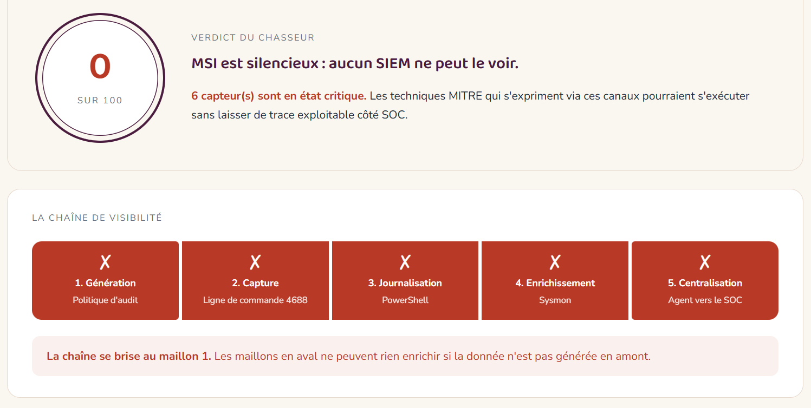

# huntReady-compagnon

> *« Le poste peut-il être vu par mon SOC ? »*

`huntReady-compagnon` est un outil PowerShell d'audit de la **télémétrie de chasse** sur les postes Windows. Là où d'autres outils mesurent à quel point un poste est *dur*, huntReady mesure à quel point il est **audible** : un poste durci mais silencieux reste un angle mort pour le SOC.

## Pourquoi ?

Toute détection moderne — **Wazuh, Splunk, Sentinel, ELK, QRadar** — repose sur la télémétrie générée par Windows lui-même. Si l'événement n'est pas enregistré à la source, aucun SIEM ne peut le détecter, peu importe la qualité des règles.

huntReady vérifie que les capteurs essentiels à la chasse sont en place sur chaque poste, et matérialise les **techniques MITRE ATT&CK** qui passeraient inaperçues sans eux.

## Aperçu



## Ce que huntReady vérifie

Six contrôles répartis sur cinq maillons de la chaîne de visibilité, plus une dimension transversale de rétention :

| # | Contrôle | Maillon |
|---|----------|---------|
| 01 | Politique d'audit avancée | Génération |
| 02 | Création de processus avec ligne de commande (event 4688) | Capture |
| 03 | Journalisation PowerShell (ScriptBlock, Module, Transcription) | Journalisation |
| 04 | Sysmon | Enrichissement |
| 05 | Centralisation des logs vers le SOC | Centralisation |
| 06 | Capacité des journaux | *Transversal* |

Chaque contrôle non conforme affiche les **techniques MITRE ATT&CK** qui passeront inaperçues sans ce capteur — pour matérialiser concrètement la perte de visibilité côté SOC.

## Installation

```powershell
git clone https://github.com/Yeni-raamia/huntReady-compagnon.git
cd huntReady-compagnon
```

Ou télécharger l'archive ZIP depuis la dernière release.

## Utilisation

Ouvrir **PowerShell en administrateur** dans le dossier du projet et lancer :

```powershell
.\huntReady.ps1
```

Le script :
- exécute les six contrôles
- affiche un score `/ 100` dans la console
- génère un rapport HTML (`rapport.html`) ouvert automatiquement dans le navigateur

Aucune dépendance externe. Compatible PowerShell 5.1 et 7. **Tout est local** : aucune donnée n'est envoyée à l'extérieur, le rapport reste sur le poste audité.

## Le score

| Score | Verdict |
|-------|---------|
| **≥ 80**  | Le poste parle correctement au SOC |
| **50 – 79** | Le poste n'est qu'à moitié audible |
| **< 50**  | Le poste est silencieux : aucun SIEM ne peut le voir |

Chaque contrôle est pondéré selon sa criticité (poids 2 ou 3). Conforme rapporte les points pleins, Attention la moitié, Critique zéro.

## Corriger les écarts

L'audit montre *ce qui manque* ; `huntReady-fix.ps1` aide à le **corriger**. Il est volontairement séparé de l'audit, qui reste strictement non destructif.

Ouvrir **PowerShell en administrateur** dans le dossier du projet et lancer :

```powershell
.\huntReady-fix.ps1
```

Le correcteur applique, **une par une et après confirmation explicite**, les corrections à la portée d'un poste local :

| Correction | Maillon |
|------------|---------|
| Politique d'audit avancée | Génération |
| Ligne de commande dans l'event 4688 | Capture |
| Journalisation PowerShell (ScriptBlock, Module, Transcription) | Journalisation |
| Capacité du journal Security | *Transversal* |

Trois garde-fous :
- **Rien sans confirmation** — chaque correction est proposée, jamais imposée.
- **Sauvegarde avant modification** — l'état d'origine est enregistré dans `sauvegardes/`, avec la commande exacte de restauration.
- **Idempotent** — ce qui est déjà conforme n'est jamais touché.

À la fin, un **journal d'intervention** (`rapport-intervention.html`) présente le score de visibilité **avant → après** et le détail des changements. L'enrichissement (Sysmon) et la centralisation (SIEM) ne sont pas modifiés automatiquement : le score plafonne tant qu'ils ne sont pas en place, ce qui désigne la suite du travail.

## Famille « Outils Compagnon »

huntReady appartient à une famille d'outils compagnon pour la cybersécurité opérationnelle :

- [**browsercheck-compagnon**](https://github.com/Yeni-raamia/browsercheck-compagnon) — Audit des navigateurs
- [**winCheck-compagnon**](https://github.com/Yeni-raamia/winCheck-compagnon) — Audit du durcissement Windows
- **huntReady-compagnon** — Audit de la télémétrie SOC *(vous êtes ici)*

Chacun couvre un angle complémentaire : durcissement préventif, navigation, télémétrie de détection.

## Auteur

**DOUKAKAS Yeni** — DSSI à la DGDI, Gabon

## Licence

MIT — voir [LICENSE](LICENSE).